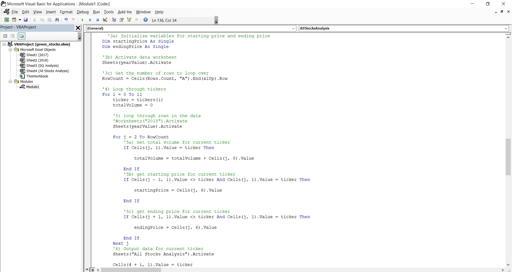
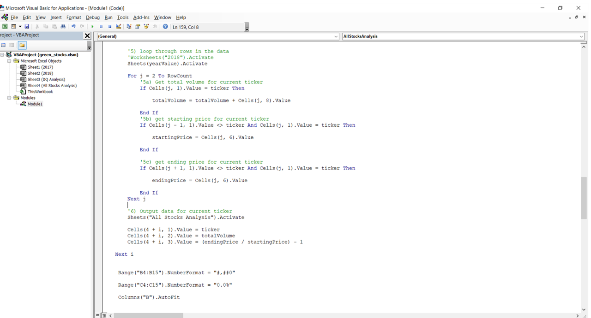
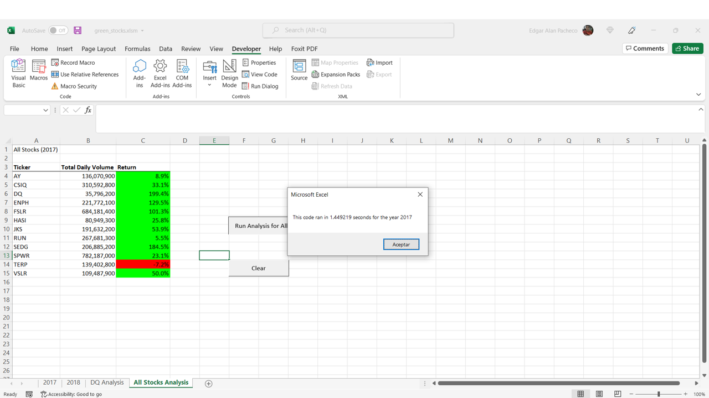
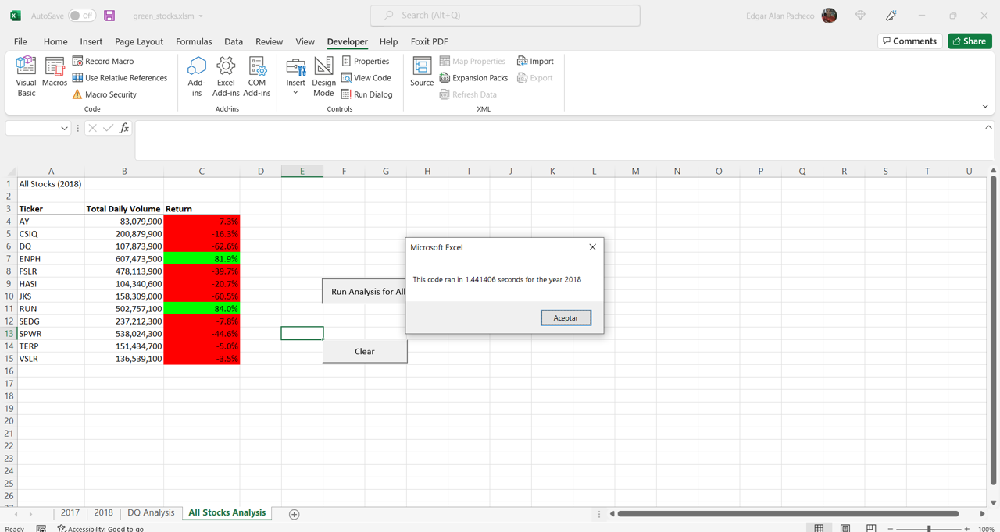
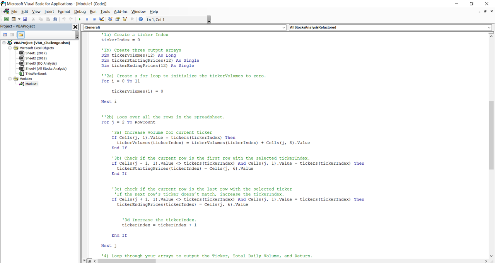
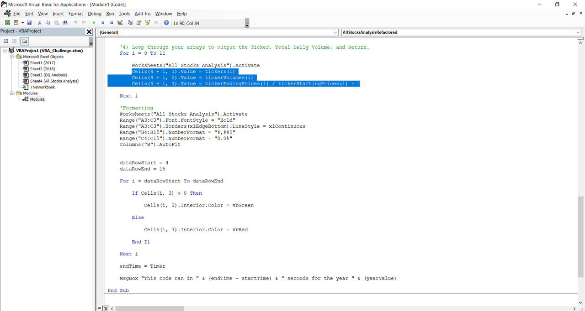
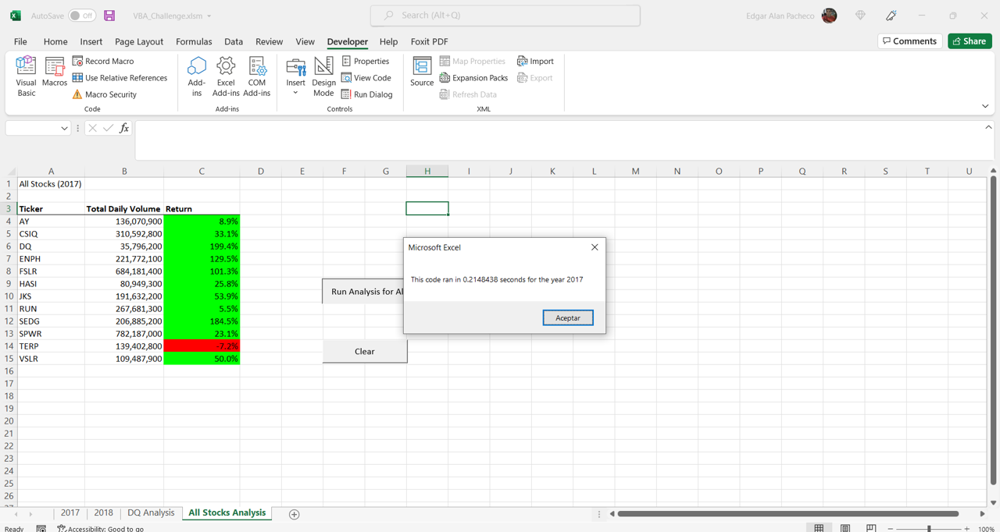
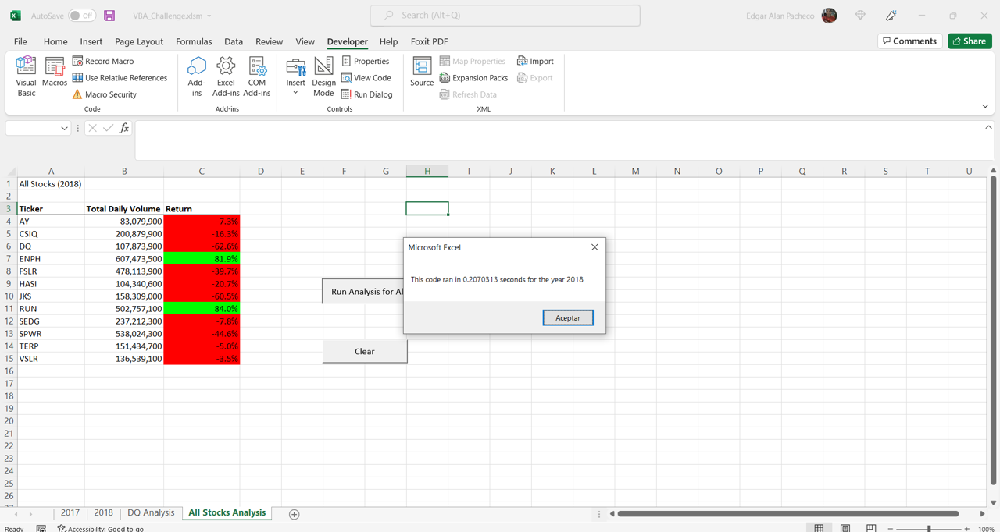

# Refactoring VBA Excel Code and Measure Performance

## Overview of Project

### Purpose

The main objective of this Challenge is mainly optimizing the VBA code from the activity “refactor the code”, which was a first look to this programing language and with this information the code was transformed using the same functionality and getting the same results. Once the code was rewritten, we can observe that the process of refactoring had a significant reduction in time by using this new code.

## Results

### Code programed for Module 2

In this code there’s a nested loop, the outer loop goes thru each of the 12 values that contain the array of tickers.

The variable ticker is storing each value of the array of tickers, and the variable totalVolume starts from zero, because is storing of the total of the daily volume.

Both variables ticker and totalVolume are using the internal loop to go thru each row of the spreadsheet and by doing this we obtain the total volume and the Starting Price and Ending Price of each ticker.

Before ending this process, the outer loop prints in the spreadsheet the info of each ticker: name with the variable ticker, daily volume with the variable totalVolume, and the return with the formula endingPrice / startPrice -1.

By executing the previous code, we get the following run times:
 -For the year 2017: 1.44 seconds
     

 -For the year 2018: 1.44 seconds
     

   
   

### Code programed for this Challenge

Unlike the previous code, we use three arrays to group the information for each ticker: total volume, starting price, ending price. [VBA_Challenge](VBA_Challenge.xlsm).

The variable tickerIndex was created with the value of cero, this variable will be executed in the beginning of each inner loop

Unlike the previous code, in this optimized version we include 3 loops with the arrays:
  -The first loop is created to initialize the entire totalVolumes array to zero.
  -The second, a loop that runs through all the rows, the value of the array where the index is tickerIndex will be called and the totalVolume array will be fed in the same way with the StartingPrice and EndingPrice arrays.

 

  -The third loop goes thru each of the arrays and prints in the spreadsheet the info of each ticker: name with the variable ticker, daily volume with the variable totalVolume, and the return with the formula endingPrice / startPrice -1.
 
  

By executing the previous code, we get the following run times:
 -For the year 2017: 0.21 seconds

 

 -For the year 2018: 0.20 seconds

 

In conclusion, the refactoring of the code gave great results because it was executed in less time than the original code, with this we conclude that working with arrays was more efficient than working with pure individual variables.

   

## Summary

**- What are the advantages or disadvantages of refactoring code?**

    - Adavantages
      -Less RAM memory resources are used; fewer lines of code and variables can be optimized and arrays used instead
      -The code runs and prints results faster
      -We can have a better understanding of what the code does, reading it can be easier to understand.
      -It helps finding errors more easily and quickly. As well as it helps for code maintenance in cases where adjustments are required.

    - Disadvantages
      -It helps finding errors more easily and quickly. As well as it helps for code maintenance in cases where adjustments are required.
      -It can take a long time to optimize the code.
      -During the refactoring process, new errors can be detected which will take time to be corrected.

**- How do these pros and cons apply to refactoring the original VBA script?**

    -Pros
     -The code runs faster and if you print results, they are also quickly displayed on the screen. We can see it in the differences in the execution times of this challenge, being the best code the one that we work with refactoring.
     -We can have a better understanding of what the code does, reading it can be easier to understand. With the arrays theme, it makes it easier to read, as well as adding comments in certain parts of the code to know what is being done.

    -Cons
     -It can take a long time to be optimizing the code. It requires making the settings carefully, being careful to know where and how to use the tickerIndex variable, doing the totalVolume calculation and carefully printing the results on the corresponding spreadsheet.